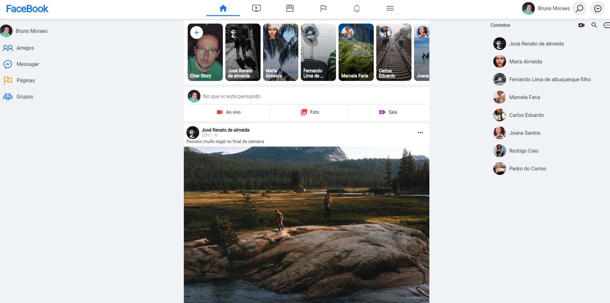
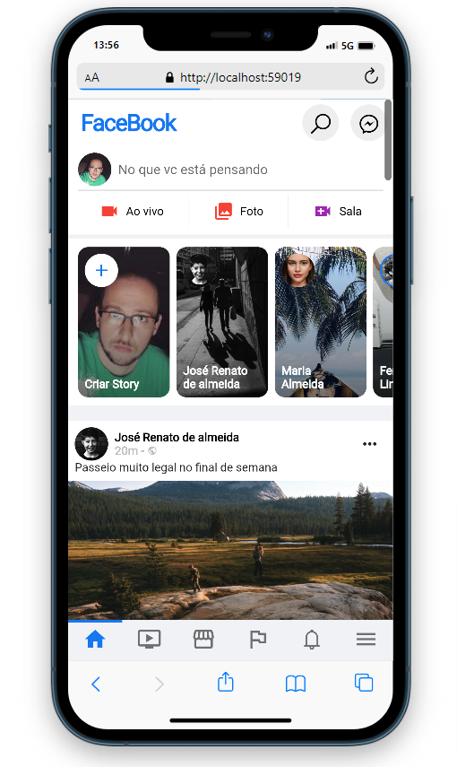

# clone_facebook

## Resumo e descrição do projeto

Clone da interface principal do Facebook, usando Flutter Web e banco de dados local para facilitar a gestão de conteúdos

## Fotos

 

## Tecnologias

Este projeto foi feito utilizando as seguintes tecnologias:

- [Flutter >=2.16.1 <3.0.0](https://flutter.dev/?gclid=Cj0KCQjw_4-SBhCgARIsAAlegrWre69wAyq0ggTX2J7Li-x2qBHAG0AoDF5n7e28Nk_-hInwktwwVmoaAidjEALw_wcB&gclsrc=aw.ds)
- [cupertino_icons](https://pub.dev/packages/cupertino_icons)
- [line_icons](https://pub.dev/packages/line_icons)
- [cached_network_image](https://pub.dev/packages/cached_network_image)

